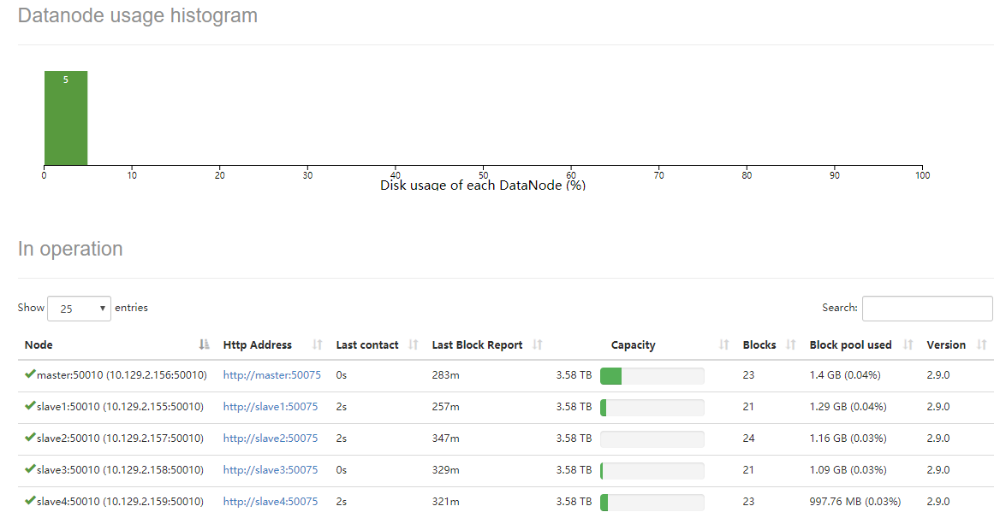
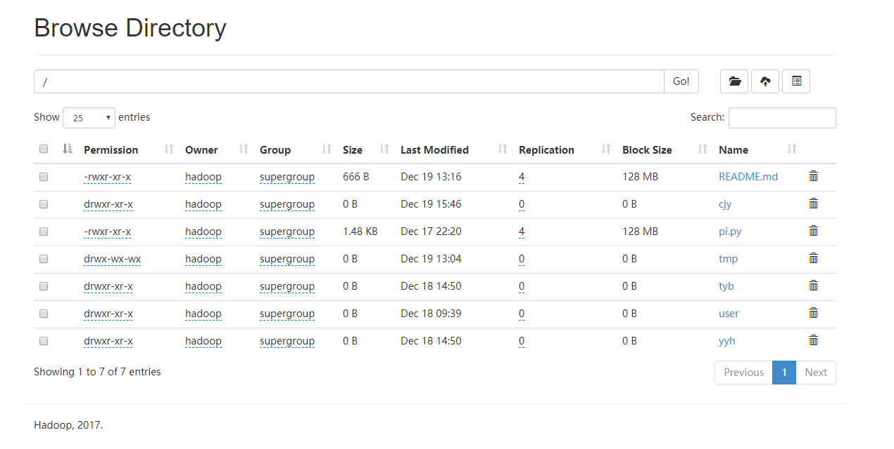

# Hadoop搭建指南

## 目录

1 Hadoop基本介绍 2

1.1 Hadoop简介 2

1.2 Hadoop生态系统 2

1.3 Hadoop集群的部署结构图 2

2 具体搭建步骤 3

2.1 预备工作 3

2.1.1 修改主机名 3

2.1.2 设置HOST映射文件 3

2.2 配置运行环境 3

2.2.3 JDK安装及配置 4

2.2.4 JDK安装及配置 4

2.2.5 ssh免密登陆 4

2.3 Hadoop安装配置 4

2.3.6 配置hadoop-env.sh 5

2.3.7 配置yarn-env.sh 5

2.3.8 配置core-site.xml 5

2.3.9 配置hdfs-site.xml 6

2.3.10 配置mapred-site.xml 6

2.3.11 配置yarn-site.xml 7

2.3.12 配置slaves文件 8

2.4 启动hadoop服务 8

2.4.13 格式化Namenode\(只需要一次\) 8

2.4.14 启动HDFS 8

2.4.15 启动YARN 9

3 计算平台验证 10

3.1 HDFS服务： 10

3.2 YARN服务 11

4 参考资料 12

## Hadoop基本介绍

### Hadoop简介

Hadoop是一个用Java编写的Apache开源框架，允许使用简单的编程模型跨计算机集群分布式处理大型数据集。Hadoop框架工作的应用程序在跨计算机集群提供分布式存储和计算的环境中工作。Hadoop旨在从单个服务器扩展到数千个机器，每个都提供本地计算和存储。

### Hadoop生态系统

Hadoop由HDFS、MapReduce、HBase、Hive和ZooKeeper等成员组成，其中最基础最重要元素为底层用于存储集群中所有存储节点文件的文件系统HDFS（Hadoop Distributed File System）来执行MapReduce程序的MapReduce引擎。

图 Hadoop生态系统

### Hadoop集群的部署结构图

## 具体搭建步骤

集群基本信息：

| IP | 155 | 156 | 157 | 158 | 159 |
| :--- | :--- | :--- | :--- | :--- | :--- |
| 机名 | slave1 | master | slave2 | slave2 | slave2 |
| 内存/cpu | 4\*32/4\*8 | 4\*32/4\*8 | 4\*32/4\*8 | 4\*32/4\*6 | 4\*32/4\*6 |
| HDFS | NameNode | Datanode | Datanode | Datanode | Datanode |
| Yarn | ResourceManager | NodeManager | NodeManager | NodeManager | NodeManager |
| Hive | MySQL |  |  |  |  |

使用版本

JDK-1.8.0\_221

Scala-2.11.8

hadoop-2.9.0

hive-2.3.6

spark-2.1.0

### 预备工作

#### 修改主机名

/etc/hostname中存放的是主机名：vim /etc/hostname

#### 设置HOST映射文件

使用root身份编辑/etc/hosts映射文件，设置IP地址与机器名的映射，设置信息如下：

vim /etc/hosts

10.129.2.156 master

10.129.2.155 slave1

10.129.2.157 slave2

10.129.2.157 slave3

10.129.2.157 slave4

### 配置运行环境

#### JDK安装及配置

* 下载linux使用的java包，解压到路径下，设置读写权限，解压，配置：
* sudo vim ~/.bashrc文件，添加如下内容：

export JAVA\_HOME=/usr/lib/java/jdk1.8.0\_221

export PATH=PATH:PATH:JAVA\_HOME/bin

export CLASSPATH=.:$JAVA\_HOME/lib/dt.jar:$JAVA\_HOME/lib/dt.jar:$JAVA\_HOME/lib/tools.jar

* 使用命令生效：source ~/.bashrc
* 校验：java –version

#### JDK安装及配置

* 下载linux使用的scala包，解压到路径下，设置读写权限，解压，配置：
* sudo vim ~/.bashrc文件，添加如下内容：

export SCALA\_HOME=/opt/app/scala-2.10.4

export PATH=PATH:PATH:SCALA\_HOME/bin

* 使用命令生效：source ~/.bashrc
* 校验：scala –version

#### ssh免密登陆

每台机器均执行如下命令：

\# ssh-keygen -t rsa

\# ssh-copy-id master

\# ssh-copy-id slave1

\# ssh-copy-id slave2

### Hadoop安装配置

* 下载linux 使用的scala包，解压到路径下，设置读写权限，解压，配置：
* 在~/ hadoop 路径下配置hadoop七大文件：

#### 配置hadoop-env.sh

* vim hadoop-env.sh
* 入配置内容，设置JAVA\_HOME和PATH路径:

export JAVA\_HOME=/usr/lib/java/jdk1.8.0\_151

export PATH=$PATH:/opt/app/hadoop-2.9.0/bin

* source hadoop-env.sh

#### 配置yarn-env.sh

* vim yarn-env.sh
* 入配置内容，设置JAVA\_HOME和PATH路径:

export JAVA\_HOME=/usr/lib/java/jdk1.8.0\_151

* source yarn-env.sh

#### 配置core-site.xml

* vim core-site.xml
* 配置的点有fs默认名字、默认FS、IO操作的文件缓冲区大小、tmp目录、代理用户hosts、代理用户组，共6点。

&lt;configuration&gt;

&lt;property&gt;

 &lt;name&gt;fs.default.name&lt;/name&gt;

 &lt;value&gt;hdfs://slave1:50090&lt;/value&gt;

 &lt;/property&gt;

 &lt;property&gt;

 &lt;name&gt;fs:defaultFS&lt;/name&gt;

 &lt;value&gt;hdfs://slave1:50090 &lt;/value&gt;

 &lt;/property&gt;

 &lt;property&gt;

 &lt;name&gt;io.file.buffer.size&lt;/name&gt;

 &lt;value&gt;131072&lt;/value&gt;

 &lt;/property&gt;

 &lt;property&gt;

 &lt;name&gt;hadoop.tmp.dir&lt;/name&gt;

 &lt;value&gt;file:/opt/app/hadoop-2.9.0/tmp&lt;/value&gt;

 &lt;/property&gt;

 &lt;property&gt;

 &lt;name&gt;hadoop.proxyuser.hduser.hosts&lt;/name&gt;

 &lt;value&gt;\*&lt;/value&gt;

 &lt;/property&gt;

 &lt;property&gt;

 &lt;name&gt;hadoop.proxyuser.hduser.groups&lt;/name&gt;

 &lt;value&gt;\*&lt;/value&gt;

 &lt;/property&gt;

&lt;property&gt;

 &lt;name&gt;hadoop.http.staticuser &lt;/name&gt;

 &lt;value&gt;hadoop&lt;/value&gt;

 &lt;/property&gt;

&lt;/configuration&gt;

#### 配置hdfs-site.xml

* vim hdfs-site.xml
* hdfs-site.xml配置的点有namenode的secondary、name目录、data目录、备份数目、开启webhdfs，共5点

&lt;configuration&gt;

 &lt;property&gt;

 &lt;name&gt;dfs.namenode.secondary.http-address&lt;/name&gt;

 &lt;value&gt;slave1:50090&lt;/value&gt;

 &lt;/property&gt;

 &lt;property&gt;

 &lt;name&gt;dfs.namenode.name.dir&lt;/name&gt;

 &lt;value&gt;file:/opt/app/hadoop-2.9.0/name&lt;/value&gt;

 &lt;/property&gt;

 &lt;property&gt;

 &lt;name&gt;dfs.datanode.data.dir&lt;/name&gt;

 &lt;value&gt;file:/opt/app/hadoop-2.9.0/data&lt;/value&gt;

 &lt;/property&gt;

 &lt;property&gt;

 &lt;name&gt;dfs.replication&lt;/name&gt;

 &lt;value&gt;2&lt;/value&gt;

 &lt;/property&gt;

 &lt;property&gt;

 &lt;name&gt;dfs.webhdfs.enabled&lt;/name&gt;

 &lt;value&gt;true&lt;/value&gt;

 &lt;/property&gt;

&lt;/configuration&gt;

#### 配置mapred-site.xml

* Vim hdfs-site.xml
* mapred-site.xml配置的点有mapreduce的框架、jobhistory的地址、jobhistory的webapp地址，共3点。

&lt;configuration&gt;

 &lt;property&gt;

 &lt;name&gt;mapreduce.framework.name&lt;/name&gt;

 &lt;value&gt;yarn&lt;/value&gt;

 &lt;/property&gt;

 &lt;property&gt;

 &lt;name&gt;mapreduce.jobhistory.address&lt;/name&gt;

 &lt;value&gt;slave1:10020&lt;/value&gt;

 &lt;/property&gt;

 &lt;property&gt;

 &lt;name&gt;mapreduce.jobhistory.webapp.address&lt;/name&gt;

 &lt;value&gt;slave1:19888&lt;/value&gt;

 &lt;/property&gt;

&lt;/configuration&gt;

#### 配置yarn-site.xml

* Vim yarn-site.xml
* yarn-site.xml配置的点有①nodemanager的aux-services及其类；②resourcemanager的地址、其sheduler地址、其resource-tracker地址、其admin地址以及webapp地址，共7点。

&lt;configuration&gt;

&lt;property&gt;

 &lt;name&gt;yarn.nodemanager.localizer.address&lt;/name&gt;

 &lt;value&gt;slave1:8050&lt;/value&gt;

 &lt;/property&gt;

 &lt;property&gt;

 &lt;name&gt;yarn.nodemanager.aux-services&lt;/name&gt;

 &lt;value&gt;mapreduce\_shuffle&lt;/value&gt;

 &lt;/property&gt;

 &lt;property&gt;

 &lt;name&gt;yarn.nodemanager.aux-services.mapreduce.shuffle.class&lt;/name&gt;

 &lt;value&gt;org.apache.hadoop.mapred.ShuffleHandler&lt;/value&gt;

 &lt;/property&gt;

 &lt;property&gt;

 &lt;name&gt;yarn.resourcemanager.address&lt;/name&gt;

 &lt;value&gt;slave1:8032&lt;/value&gt;

 &lt;/property&gt;

 &lt;property&gt;

 &lt;name&gt;yarn.resourcemanager.scheduler.address&lt;/name&gt;

 &lt;value&gt;slave1:8030&lt;/value&gt;

 &lt;/property&gt;

 &lt;property&gt;

 &lt;name&gt;yarn.resourcemanager.resource-tracker.address&lt;/name&gt;

 &lt;value&gt;slave1:8031&lt;/value&gt;

 &lt;/property&gt;

 &lt;property&gt;

 &lt;name&gt;yarn.resourcemanager.admin.address&lt;/name&gt;

 &lt;value&gt;slave1:8033&lt;/value&gt;

 &lt;/property&gt;

 &lt;property&gt;

 &lt;name&gt;yarn.resourcemanager.webapp.address&lt;/name&gt;

 &lt;value&gt;slave1:8088&lt;/value&gt;

 &lt;/property&gt;

&lt;/configuration&gt;

#### 配置slaves文件

* Vim slaves
* 在配置文件中加入如下内容：

Slave1

Slave2

Slave3

Slave4

master

### 启动hadoop服务

首先，将hadoop程序分发到5台机子上，确保都成功

启动部署，包括格式化NameNode、启动HDFS、启动YARN。

#### 格式化Namenode\(只需要一次\)

\# cd /opt/app/hadoop-2.9.0

\# ./bin/hdfs namenode –format

#### 启动HDFS

* start-dfs.sh
* 验证HDFS是否启动：jps

此时在master上面运行的进程有：NameNode、SecondaryNameNode和DataNode

#### 启动YARN

* start-yarn.sh
* 验证YARN是否启动：jps

此时在master上运行的进程有：NameNode、SecondaryNameNode、DataNode、NodeManager和ResourceManager

以上，Hadoop搭建成功。

## 计算平台验证

hadoop服务主要有以下两个：

* Hadoop HDFS\(分布式文件系统\)服务
* Hadoop YARN资源管理器服务

### HDFS服务：

通过http://&lt;master-ip&gt;:50070端口我们可以访问分布式文件系统的webUI界面，为了保证集群的数据安全性，我们设置了用户权限和登录账户密码系统。

图 3-1 HDFS用户登录界面

进入系统之后我们可以从webUI界面中看到集群的基本信息，包括但不限于分布式文件系统的节点总数、系统总容量等信息。

图 -2 HDFS系统集群概况

同时在HDFS系统中，做好本机的地址映射，即可在自己的PC上，自由的上传/下载文件，并且文件每次都复制四份。

图 -3 HDFS 上传下载文件

### YARN服务

Apache Hadoop YARN （Yet Another Resource Negotiator，另一种资源协调者）是一种新的 Hadoop 资源管理器，它是一个通用资源管理系统，可为上层应用提供统一的资源管理和调度，它的引入为集群在利用率、资源统一管理和数据共享等方面带来了巨大好处。

通过http://&lt;master-ip&gt;:8088端口我们可以访问提交任务的运行结果，资源利用率等，店家查看logs，再点击stdout：

图 -4 HDFS 上传下载文件

## 参考资料

第一次搭建hadoop平台主要参考的是一些中文教程，但中间还是会碰到许多问题。此时去官方网站上寻找答案和提问是最快最安全的途径，其次是Google，再其次是国内网站，因为每个人遇到的问题都有所不同，最好的解决办法是查询报错的Logs，以下是我在搭建过程中参考的一些网站，当然更推荐官方的。

* Hadoop安装

[https://www.cnblogs.com/swordfall/p/7868589.html?tdsourcetag=s\_pcqq\_aiomsg](https://www.cnblogs.com/swordfall/p/7868589.html?tdsourcetag=s_pcqq_aiomsg)

* Hadoop下载：[http://www.apache.org/dyn/closer.cgi/hadoop/common/hadoop-2.9.0/hadoop-2.9.0.tar.gz](http://www.apache.org/dyn/closer.cgi/hadoop/common/hadoop-2.9.0/hadoop-2.9.0.tar.gz)
* JDK下载：

[http://www.oracle.com/technetwork/java/javase/downloads/jdk8-downloads-2133151.html](http://www.oracle.com/technetwork/java/javase/downloads/jdk8-downloads-2133151.html)

* Scala下载：

[https://www.scala-lang.org/download/2.11.8.html](https://www.scala-lang.org/download/2.11.8.html)

* Ssh免密登陆设置

[https://www.cnblogs.com/xiaoaofengyue/p/8080639.html](https://www.cnblogs.com/xiaoaofengyue/p/8080639.html)

