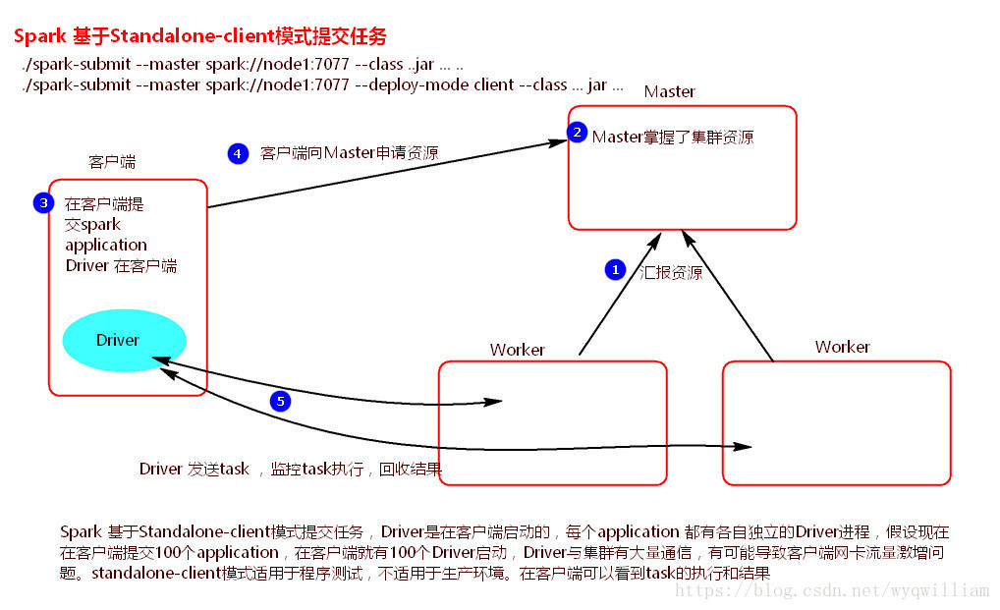
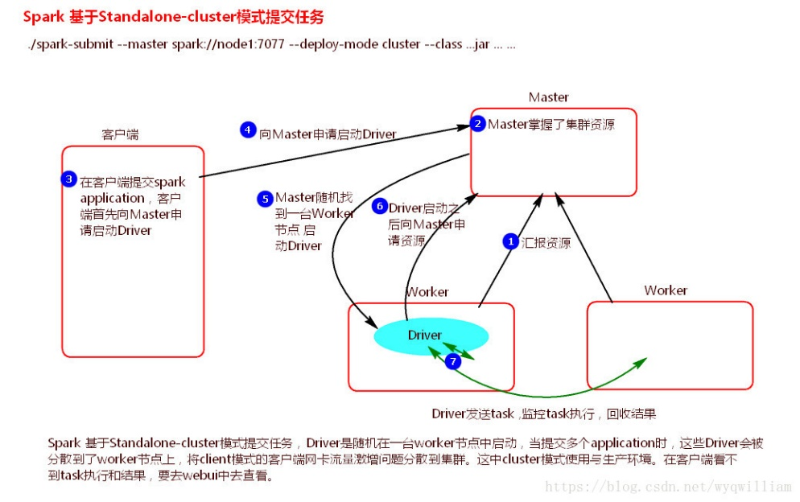
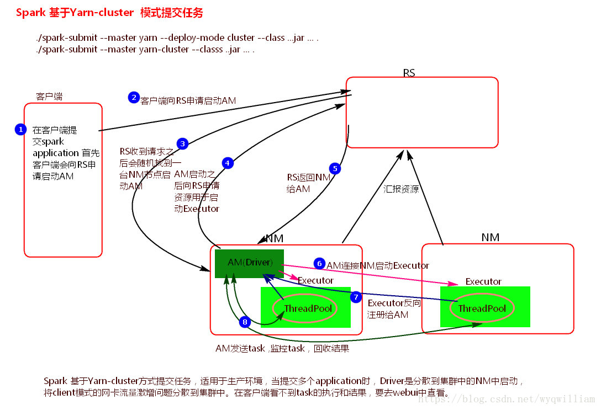
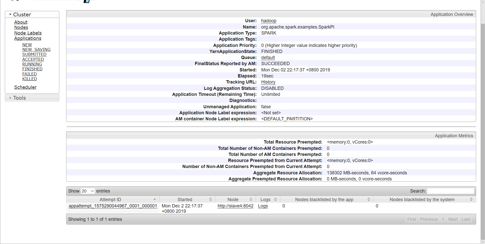
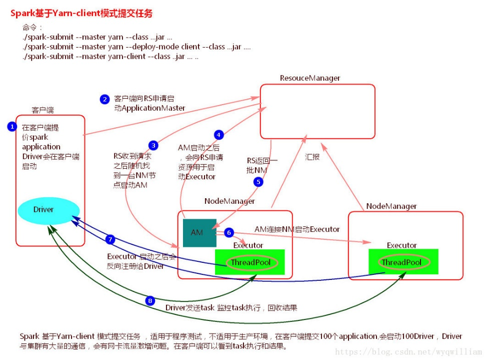

# 集群使用手册（下）

## 目录

一、 Spark Standalone Mode 

1.1 简介： 

1.2 client模式（默认） 

1.3 cluster模式\(不显示运行结果\) 

二、 Spark on YARN 

2.1 简介 

2.2 yarn-cluster和yarn-client模式的区别 

2.3 yarn-cluster模式 

2.4 yarn-client模式（默认） 

三、 Spark on Mesos 

四、 Spark on Kubernetes 

## 部署方式简介

目前Apache Spark支持三种分布式部署方式，分别是：

* `Standalone`
* `spark on mesos`
* `spark on YARN`

具体介绍如下网址：

[https://blog.csdn.net/sanyaoxu\_2/article/details/79378626](https://blog.csdn.net/sanyaoxu_2/article/details/79378626)

从对比上看，mesos似乎是Spark更好的选择，也是被官方推荐的

* 但如果你同时运行hadoop和Spark,从兼容性上考虑，Yarn是更好的选择。
* 如果你不仅运行了hadoop，spark。还在资源管理上运行了docker，Mesos更加通用。
* Standalone对于小规模计算集群更适合！

## Spark Standalone Mode

### 1.1 简介：

[http://spark.apache.org/docs/latest/spark-standalone.html](http://spark.apache.org/docs/latest/spark-standalone.html)

在Spark 的Standalone模式中：

#### 提交参数：

–deploy-mode: 允许决定是否在本地（使用client）启动Spark驱动成簇的参数，或者在集群内（使用cluster选项）的其中一台工作机器上启动。默人是client。

–name : 应用程序名称。注意，创建SparkSession时，如果是以编程方式指定应用程序名称，那么来自命令行的参数会被重写。

–exectuor-memory：参数指定每个执行器为应用程序分配多少内存。默认值是1G。

spark standalone两种提交模式，**Standalone-client** 和**Standalone-master** 模式

区别：**默认是client模式**

#### 命令

```text
spark-submit
--master spark://master:7077
--deploy-mode client
--executor-memory 5000
--total-executor-cores 12
xxxxxxxxx.py
```

#### e.g:

```text
spark-submit
\ --master spark://master:7077
\ --class org.apache.spark.examples.SparkPi
\ spark-examples.jar 100
```

解释：

**--class org.apache.spark.examples.SparkPi main函数**

100 main函数需要的参数

### 1.2 client模式（默认）

#### 命令

`./spark-submit --master spark://master:7077 --class ... jar ... 参数`

`./spark-submit --master spark://master:7077 --deploy-mode client --class .. jar ..`

#### 过程

a\).在客户端提交Spark应用程序，会在客户端启动Driver。

b\).客户端向Master申请资源，Master找到资源返回。

c\).Driver发送task。

**注意**：

client方式提交任务，在客户端提交多个application，客户端会为每个application都启动一个Driver，Driver与集群Worker节点有大量通信，这样会造成客户端网卡流量激增。client方式提交任务适用于程序测试，不适用于真实生产环境。在客户端可以看到task执行情况和计算结果。

client模式适用于测试调试程序。Driver进程是在客户端启动的，这里的客户端就是指提交应用程序的当前节点。在Driver端可以看到task执行的情况。生产环境下不能使用client模式，是因为：假设要提交100个application到集群运行，Driver每次都会在client端启动，那么就会导致客户端100次网卡流量暴增的问题。（因为要监控task的运行情况，会占用很多端口，如上图的结果图）客户端网卡通信，都被task监控信息占用。



#### 结果查看

hadoop@master:~/local/sparkwithhive/examples/jars$ spark-submit --class org.apache.spark.examples.SparkPi --master spark://master:7077 spark-examples\_2.11-2.1.0.jar 1000 2&gt;&1 \| grep "Pi is roughly"

结果可在10.129.2.155:18081口查看


### 1.3 cluster模式\(不显示运行结果\)

#### 命令

./spark-submit --master spark://master:7077 --deploy-mode cluster --class ... jar ...

#### 过程

a\).客户端提交application，客户端首先向Master申请启动Driver

b\).Master收到请求之后，随机在一台Worker节点上启动Driver

c\).Driver启动之后，向Master申请资源，Master返回资源。

d\).Driver发送task.

**注意**：

cluster方式提交任务，Driver在集群中的随机一台Worker节点上启动，分散了client方式的网卡流量激增问题。

cluster方式适用于真实生产环境，在客户端看不到task执行情况和执行结果，要去WEBUI中去查看。



## Spark on YARN

### 2.1 简介

[http://spark.apache.org/docs/latest/running-on-yarn.html](http://spark.apache.org/docs/latest/running-on-yarn.html)

* Application Master

在YARN中，每个Application实例都有一个Application Master进程，它是Application启动的第一个容器。它负责和ResourceManager打交道，并请求资源。获取资源之后告诉NodeManager为其启动container。

### 2.2 yarn-cluster和yarn-client模式的区别

yarn-cluster和yarn-client模式的区别就是Application Master\(AM\)进程的区别

yarn-cluster模式下，driver运行在AM中，它负责向YARN申请资源，并监督作业的运行状况。当用户提交了作业之后，就可以关掉Client，作业会继续在YARN上运行,显然yarn-cluster模式不适合运行交互类型的作业。

而yarn-client模式下，ApplicationMaster仅仅向YARN请求executor，client会和请求的container通信来调度他们工作，也就是说Client不能离开。

从广义上讲，yarn-cluster适用于生产环境；而yarn-client适用于交互和调试，也就是希望快速地看到application的输出。

\(参考链接[https://blog.csdn.net/sanmu007it/article/details/55509239](https://blog.csdn.net/sanmu007it/article/details/55509239)\)

### 2.3 yarn-cluster模式

#### 命令：

`./spark-submit --master yarn-cluster --class ...jar .... ..`

`./spark-submit --master yarn --deploy-mode cluster --class ..jar ... ..`

注：因为在cluster模式下，driver在集群中的任意一节点执行，所以要把jar文件上传到HDFS上。

[https://blog.csdn.net/u012637358/article/details/86703786](https://blog.csdn.net/u012637358/article/details/86703786)

但Spark的Standalone模式无法执行HDFS上的jar:

[https://blog.csdn.net/chengwenfa159/article/details/80206743](https://blog.csdn.net/chengwenfa159/article/details/80206743)

\#列出HDFS下的文件

`$ hdfs dfs -ls /`

\#创建目录文件如‘sparkapp’

`$hdfs dfs -mkdir /sparkapp`

\#上传打包好的xx.jar到/sparkapp目录下

$hdfs dfs -put /loaclpath/xx.jar /sparkapp

\#查看已上传的文件

$ hdfs dfs -ls /sparkapp

$spark-submit --master yarn-cluster --class SimpleApp hdfs://master:50090/

user/hadoop/wordcount2.jar

#### 过程

a\).客户端提交Application,首先客户端向ResourceManager申请启动ApplicationMaster

b\).ResourceManager收到请求之后，随机在一台NodeManager中启动ApplicationMaster,这里ApplicationMaster就相当于是Driver

c\).ApplicationMaster启动之后，向ResourceManager申请资源，用于启动Executor

d\).ResourceManager收到请求之后，找到资源返回给ApplicationMaster

e\).ApplicationMaster连接NodeManager启动Executor

f\).Executor启动之后会反向注册给ApplicationMaster\(Driver\)

g\).Driver发送task到Executor执行

**注意**：

cluster方式提交任务，Driver在集群中的随机一台Worker节点上启动，分散了client方式的网卡流量激增问题。

cluster方式适用于真实生产环境，在客户端看不到task执行情况和执行结果，要去WEBUI中去查看。

ApplicationMaster的作用：

i\).申请资源 ii\).启动Executor iii\).任务调度



#### 结果查看

结果在10.129.2.155.18081查看



### 2.4 yarn-client模式（默认）

#### 命令：

./spark-submit --master yarn --class ... jar ... ....

./spark-submit --master yarn-client --class ...jar ....

./spark-submit --master yarn --deploy-mode client --class ..jar ...

#### 过程：

a\).客户端提交application,Driver会在客户端启动

b\).客户端向ResourceManager申请启动ApplicationMaster

c\).ResourceManager收到请求之后，随机在一台NodeManager中启动ApplicationMaster

d\).ApplicationMaster启动之后，向ResourceManager申请资源，用于启动Executor

e\).ResourceManager收到请求之后，找到资源返回给ApplicationMaster

f\).ApplicationMaster连接NodeManager启动Executor

g\).Executor启动之后会反向注册给Driver

h\).Driver发送task到Executor执行

**注意**：

client方式提交任务，在客户端提交多个application，客户端会为每个application都启动一个Driver，Driver与集群Worker节点有大量通信，这样会造成客户端网卡流量激增。client方式提交任务适用于程序测试，不适用于真实生产环境。在客户端可以看到task执行情况和计算结果。

Driver功能：

i\).发送task ii\).监控task，回收结果 iii\).申请资源



## Spark on Mesos

[http://spark.apache.org/docs/latest/running-on-mesos.html](http://spark.apache.org/docs/latest/running-on-mesos.html)

## Spark on Kubernetes

[http://spark.apache.org/docs/latest/running-on-kubernetes.html](http://spark.apache.org/docs/latest/running-on-kubernetes.html)

