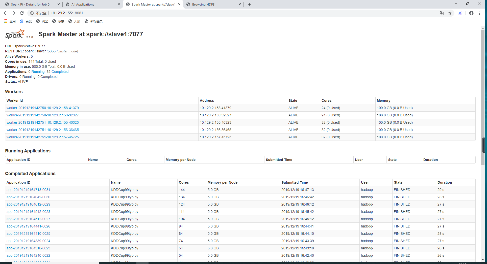

# Spark-with-hive搭建指南

1 项目简介 1

1.1 Spark简介 1

1.2 主要特点与优点 1

1.3 Spark生态系统 1 

2 Spark搭建 2

2.1 Spark安装主要任务 2

2.2 修改配置文件 2

2.3 配置conf/slaves 2

2.4 配置conf/spark-env.sh 2

2.5 启动spark 3

3 Hive安装 4

3.1 配置环境变量 4

3.2 配置conf/hive-site.xml 4

4 Mysql安装 5

4.1 Ubuntu下安装mysql 5

4.2 测试是否mysql安装成功 5

4.3 Mysql与hive配置 5

5 Hive && spark 6

5.1 Spark on hive 6

5.2 Hive on spark 6

6 计算平台验证 7

7 参考资料 8

## 项目简介

### Spark简介

Spark最初由美国加州伯克利大学（UCBerkeley）的AMP实验室于2009年开发，是基于内存计算的大数据并行计算框架，可用于构建大型的、低延迟的数据分析应用程序

### 主要特点与优点

* 运行速度快：使用DAG执行引擎以支持循环数据流与内存计算
* 容易使用：支持使用Scala、Java、Python和R语言进行编程，可以通过Spark Shell进行交互式编程
* 通用性：Spark提供了完整而强大的技术栈，包括SQL查询、流式计算、机器学习和图算法组件
* 运行模式多样：可运行于独立的集群模式中，可运行于Hadoop中，也可运行于Amazon EC2等云环境中，并且可以访问HDFS、Cassandra、HBase、Hive等多种数据源

### Spark生态系统

Spark的生态系统主要包含了Spark Core、Spark SQL、Spark Streaming、MLLib和GraphX 等组件

图1 spark生态系统

## Spark搭建

Spark的安装建立在hadoop的基础上，之前的一些基础配置就不再重复，请先完成hadoop集群的安装，再安装spark。

### Spark安装主要任务

* 下载，上传服务器安装包；

• Spark配置集群，配置 ~/.bashrc、conf/slaves以及conf/spark-env.sh

• 直接启动验证，通过jps和宿主机浏览器验证

• 启动spark-shell客户端，通过宿主机浏览器验证

### 修改配置文件

* Vim ~/.bashrc
* 定义SPARK\_HOME并把spark路径加入到PATH参数中

export SPARK\_HOME=/opt/app/spark-2.2.0-bin-hadoop2.7

export PATH=PATH:PATH:SPARK\_HOME/bin:$SPARK\_HOME/sbin

### 配置conf/slaves

进入spark目录下

* 打开配置文件conf/slaves，默认情况下没有slaves，需要使用cp命令复制slaves.template

\# cp slaves.template slaves

\# vim slaves

* 加入slaves配置节点slave1-4,master

Slave1

Slave2

### 配置conf/spark-env.sh

* 打开配置文件conf/slaves，默认情况下没有slaves，需要使用cp命令复制spark-env.sh.template spark-env.sh

\# cp spark-env.sh.template spark-env.sh

\# vim spark-env.sh

* 加入如下环境配置内容，设置slave1为Master节点

export JAVA\_HOME=/usr/lib/java/jdk1.8.0\_221

export SPARK\_MASTER\_IP=slave1

export SPARK\_MASTER\_PORT=7077

export SPARK\_WORKER\_CORES=32

export SPARK\_WORKER\_INSTANCES=1

export SPARK\_WORKER\_MEMORY=100G

### 启动spark

* Start-master.sh
* Start-slaves.sh
* Slave1节点上的进程有：

* 其余节点上的进程有：

## Hive安装

### 配置环境变量

为了方便使用，我们把hive命令加入到环境变量中去，编辑~/.bashrc文件vim ~/.bashrc，在最前面一行添加:

export HIVE\_HOME=/usr/local/hive

export PATH=$PATH:$HIVE\_HOME/bin

### 配置conf/hive-site.xml

将hive-default.xml.template重命名为hive-default.xml；新建一个文件touch hive-site.xml，并在hive-site.xml中粘贴如下配置信息：

&lt;?xml version="1.0" encoding="UTF-8" standalone="no"?&gt;

&lt;?xml-stylesheet type="text/xsl" href="configuration.xsl"?&gt;

&lt;configuration&gt;

 &lt;property&gt;

 &lt;name&gt;javax.jdo.option.ConnectionURL&lt;/name&gt;

 &lt;value&gt;jdbc:mysql://localhost:3306/hive?createDatabaseIfNotExist=true&lt;/value&gt;

 &lt;description&gt;JDBC connect string for a JDBC metastore&lt;/description&gt;

 &lt;/property&gt;

 &lt;property&gt;

 &lt;name&gt;javax.jdo.option.ConnectionDriverName&lt;/name&gt;

 &lt;value&gt;com.mysql.jdbc.Driver&lt;/value&gt;

 &lt;description&gt;Driver class name for a JDBC metastore&lt;/description&gt;

 &lt;/property&gt;

 &lt;property&gt;

 &lt;name&gt;javax.jdo.option.ConnectionUserName&lt;/name&gt;

 &lt;value&gt;hive&lt;/value&gt;

 &lt;description&gt;username to use against metastore database&lt;/description&gt;

 &lt;/property&gt;

 &lt;property&gt;

 &lt;name&gt;javax.jdo.option.ConnectionPassword&lt;/name&gt;

&lt;value&gt;hive&lt;/value&gt;

&lt;description&gt;password to use against metastore database&lt;/description&gt;

 &lt;/property&gt;

&lt;/configuration&gt;

## Mysql安装

### Ubuntu下安装mysql

使用以下命令即可进行mysql安装，注意安装前先更新一下软件源以获得最新版本：

sudo apt-get update \#更新软件源

sudo apt-get install mysql-server \#安装mysql

### 测试是否mysql安装成功

* 启动和关闭mysql服务器：

service mysql start

service mysql stop

* 确认是否启动成功，mysql节点处于LISTEN状态表示启动成功：

udo netstat -tap \| grep mysql

### Mysql与hive配置

* 下载mysql jdbc 包
* 启动并登陆mysql shell

service mysql start \#启动mysql服务

mysql -u root -p \#登陆shell界面

* 新建hive数据库

mysql&gt; create database hive;

* 配置mysql允许hive接入

mysql&gt; grant all on \*.\* to hive@localhost identified by 'hive'; \#将所有数据库的所有表的所有权限赋给hive用户，后面的hive是配置hive-site.xml中配置的连接密码

mysql&gt; flush privileges; \#刷新mysql系统权限关系表

* 启动hive

start-all.sh \#启动hadoop

hive \#启动hive

## Hive && spark

为了让Spark能够访问Hive，必须为Spark添加Hive支持。Spark官方提供的预编译版本，通常是不包含Hive支持的，需要采用源码编译，编译得到一个包含Hive支持的Spark版本。如果你当前电脑上的Spark版本不包含Hive支持，请根据下面教程编译一个包含Hive支持的Spark版本。

为了让Spark能够访问Hive，需要把Hive的配置文件hive-site.xml拷贝到Spark的conf目录下，请在Shell命令提示符状态下操作：

cd /usr/local/sparkwithhive/conf

cp /usr/local/hive/conf/hive-site.xml .

### Spark on hive

* 启动进入spark-shell，命令如下：

cd /usr/local/sparkwithhive

./bin/spark-shell

* 启动了spark-shell，进入了“scala&gt;”命令提示符状态，请输入下面语句：

scala&gt; import org.apache.spark.sql.hive.HiveContext

import org.apache.spark.sql.hive.HiveContext

看到上面的信息，说明你当前启动的Spark版本可以支持Hive。

### Hive on spark

hive&gt;set hive.execution.engine=spark; \#默认是mr，在hive-site.xml里设置spark后，这一步可以不要

hive&gt;create table test\(ts BIGINT,line STRING\); \#创建表

hive&gt;select count\(\*\) from test;

若整个过程没有报错，并出现正确结果，则Hive on Spark配置成功。

## 计算平台验证

通过http://&lt;master-ip&gt;:18081端口我们可以访问spark计算引擎的webUI界面，在页面中可以看到worker的个数，分配的cpu核数，以及正在运行的一些任务

通过http://&lt;master-ip&gt;:18080端口我们可以访问jobhistory的webUI界面，查看已经运行的一些任务以及结果。

## 参考资料

以下是参考的一些搭建教程。注意的是，官网提供的spark有些并不支持hive。同时支持hive的有些版本也不能用，因此还是需要自己编译，我们这里用的是被人编译过的。

Myslq一开始是在未联网的情况下安装的，官网下的包安装，没有成功。可以的话还是联网安装，快速，高效。

*  Spark下载地址：[http://spark.apache.org/downloads.html](http://spark.apache.org/downloads.html)
* Spark安装教程：[https://www.cnblogs.com/swordfall/p/7903678.html](https://www.cnblogs.com/swordfall/p/7903678.html)
* Hive下载：[https://www-eu.apache.org/dist/hive/hive-2.3.6/](https://www-eu.apache.org/dist/hive/hive-2.3.6/)
* Hive安装教程：[http://dblab.xmu.edu.cn/blog/install-hive/](http://dblab.xmu.edu.cn/blog/install-hive/)
* Mysql jdbc包下载地址：

[https://dev.mysql.com/get/Downloads/Connector-J/mysql-connector-java-5.1.46.zip](https://dev.mysql.com/get/Downloads/Connector-J/mysql-connector-java-5.1.46.zip)

* Spark-on-hive教程：[http://dblab.xmu.edu.cn/blog/1383-2/](http://dblab.xmu.edu.cn/blog/1383-2/)

